<div align="center">
  
  <br/>

  <div>
    
    <a href="./LICENSE">
      
    </a >
  </div>

  <br/>

  <details>
    <summary>查看 v1.1.4 界面截图（当前开发分支界面可能不同）</summary>
    <br/>
  <picture>
    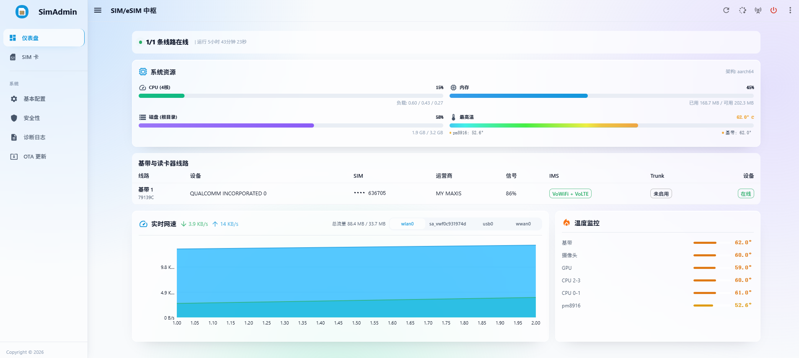
	<br/><br/>
	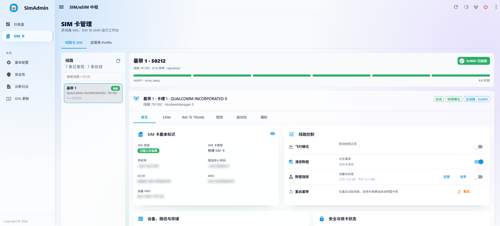
	<br/><br/>
	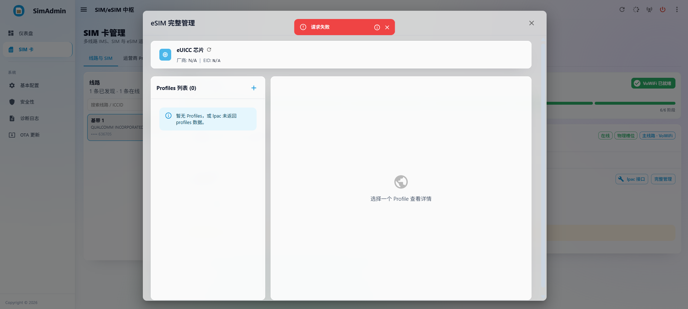
	<br/><br/>
	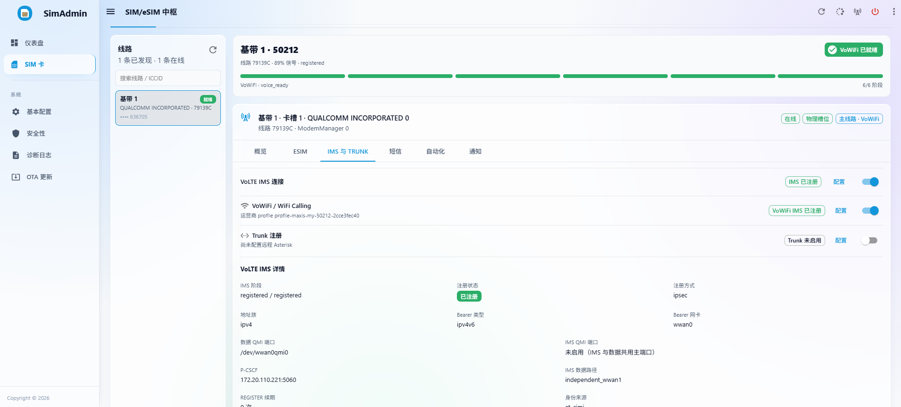
	<br/><br/>
	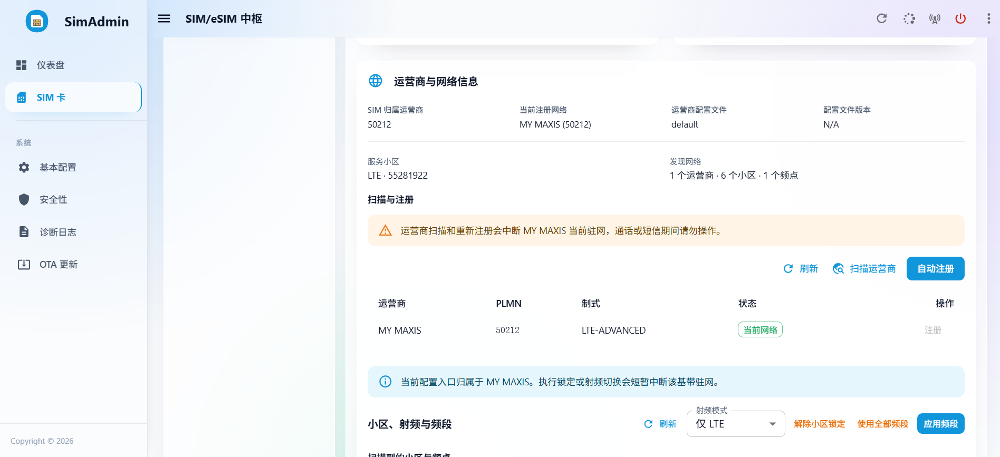
	<br/><br/>
	
	<br/><br/>
	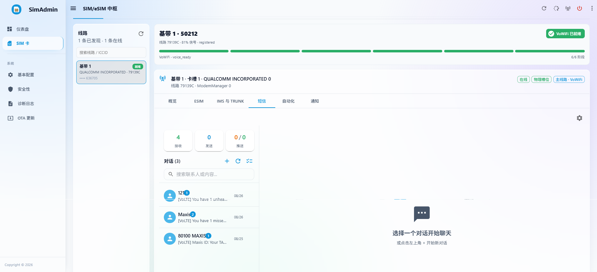
	<br/><br/>
	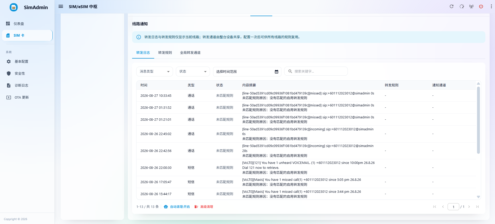
	<br/><br/>
	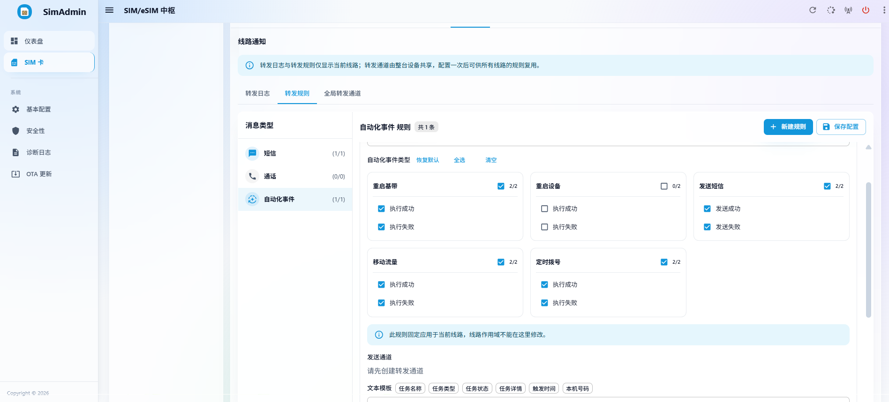
	<br/><br/>
	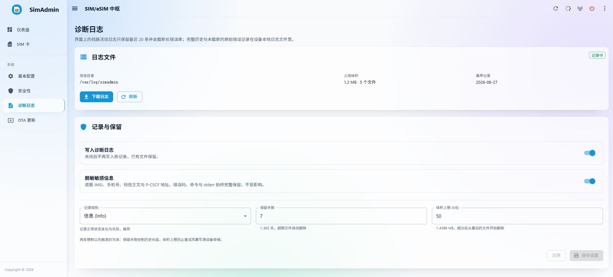
	<br/><br/>
	
	<br/><br/>
	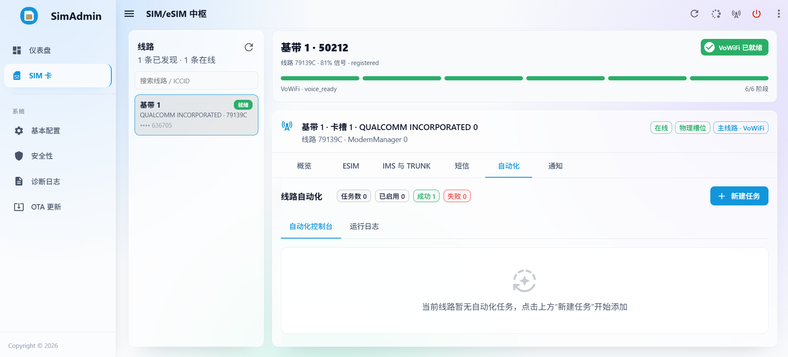
	<br/><br/>
	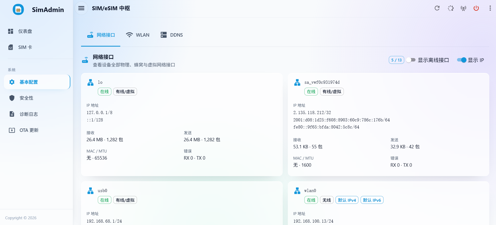
	<br/><br/>
	
	<br/><br/>
	<!-- OTA 页面截图将在新的 OTA 流程完成后重新补充。 -->
	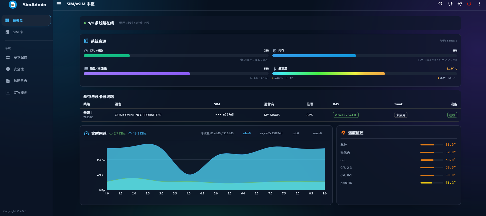
	<br/><br/>
  </picture>
  </details>


</div>

# SimAdmin - 多线路 SIM/eSIM 与 IMS 管理中枢

SimAdmin 是面向 Debian 蜂窝 CPE、随身 WiFi 和软路由设备的 Web 管理系统。它把每个
“基带 + 卡槽”建模为独立线路，在同一服务中管理 SIM/eSIM、蜂窝数据、短信、通话、
VoLTE、VoWiFi、SIP Trunk、设备网络、通知和自动化。

项目由 Rust + Axum 后端与 React + TypeScript 前端组成。后端默认通过 ModemManager
D-Bus 管理 modem，也提供需显式启用的实验性 native QMI/MBIM/AT 后端；具体完成边界见
[原生后端状态](./docs/NATIVE_BACKEND_STATUS.md)。生产环境由同一个后端进程托管前端 SPA，
默认安装到 `/opt/simadmin` 并通过 systemd 运行。

> 当前 IMS、多基带和 eSIM 能力与 modem 固件、内核驱动、运营商配置及 SIM 权限高度相关。
> “代码中提供能力”不等于所有设备均可直接使用，请在目标硬件上按真机清单验收。

## 核心能力

- **多线路隔离**：设备信息、SIM、APN、数据、漫游、飞行模式、射频/频段、运营商注册、
  VoLTE、VoWiFi、eSIM、短信和语音策略均按稳定 `line_id` 寻址与持久化。
- **多路径 IMS**：共享 SIP、Digest-AKA、短信编解码与语音核心；VoWiFi 使用内置的
  IKEv2/ESP over ePDG 用户态协议栈，VoLTE 使用独立 IMS bearer 与 Linux `ip xfrm`。
- **语音与短信编排**：短信可按线路在 VoWiFi、VoLTE、CS 之间排序与回退，IMS 语音可在
  VoWiFi、VoLTE 之间选路；同时包含接收腿选举、跨通道去重、投递记录和线路级通话控制。
- **SIP Trunk**：将线路的语音能力桥接到 Asterisk 等 SIP 端点，提供每线路配置、鉴权、
  运行状态和诊断信息。
- **eSIM/eUICC**：自动探测或按线路启停 eSIM 控制，通过私有 `lpac` 按需读取 EID、下载、
  启用、重命名和删除 Profile；支持配置独立 QMI 读卡器线路。
- **运营商 Profile**：加载只读、已封存的 carrier catalog，并允许本地覆盖；支持 AOSP APN、
  CarrierConfig 与 Apple IPCC 配置事实的导入和匹配。
- **蜂窝与设备网络**：线路级数据代理与流量统计、基带恢复、WLAN 客户端、网络接口诊断，
  以及 DNSPod、AliDNS、Cloudflare 的 IPv4/IPv6 DDNS。
- **设备运维**：短信持久化与通知转发、通知失败队列、定时/周期自动化任务、系统事件、
  单管理员认证和 SSH 密码恢复。

> 安装器已统一为带完整校验清单的离线发布包，在线入口必须固定可信仓库与版本。
> 默认只安装文件，不启动服务或激活硬件；旧 Release 不会自动获得新安装器。
> Web OTA 应用与卸载流程不在本轮验收范围。使用前请阅读 [安装指南](./docs/INSTALL.md)。

## 软件结构

```text
SimAdmin/
├── backend/          Rust 后端、硬件接入、IMS 协议栈和业务服务
├── frontend/         React 19 + TypeScript + MUI 管理界面
├── bruno-api/        可直接执行的 Bruno REST API 集合
├── docs/             安装、运维、开发、变更记录与专题资料
├── deploy/           离线安装器、设备资源、udev 和 systemd 单元
├── scripts/          构建、统一发布打包和实验室测试
├── install_latest.sh 固定版本的在线下载入口（默认不激活）
└── uninstall.sh      待重构的卸载脚本（当前不使用）
```

后端依赖方向为 `api/services -> connectivity/hardware -> platform`：

- `connectivity/core`：与传输无关的 IMS、SIP、AKA、短信与语音核心。
- `connectivity/modems/ims/{cellular_ims,vowifi}`：蜂窝 IMS 与 VoWiFi 接入实现。
- `hardware/{cellular,sim}`：ModemManager、QMI、AT、数据代理与 eSIM 设备操作。
- `services/{orchestrator,trunk,...}`：跨接入选路、Trunk、短信、通知、自动化、网络和 OTA。
- `platform`：配置、SQLite 与通用系统能力。

更完整的目录职责和开发流程见[开发者指南](./docs/DEVELOPER.md)。

## 安装

从同一源码版本构建前后端后，用 `scripts/pack-ota.sh` 生成新格式发布包。Linux/systemd
ARM64、AMD64 均受支持；目标机需要 Python 3.8+。先取得可信的包及摘要，**校验成功才解包**：

```bash
sha256sum -c simadmin-linux-arm64.tar.gz.sha256
mkdir simadmin-package
tar --no-same-owner --no-same-permissions -xzf simadmin-linux-arm64.tar.gz -C simadmin-package
sh /absolute/path/to/simadmin-package/install.sh --check
sh /absolute/path/to/simadmin-package/install.sh
```

默认不启动服务、不安装/激活设备单元；运行中的服务须在维护窗口使用显式 `--activate`
或人工部署。新安装器保留配置、数据库、catalog 和 lpac；会在停服之前拒绝不匹配的包、
架构、配置或自定义服务设置。在线 `install_latest.sh` 需明确指定 `REPO` 与 `VERSION`，
不会混用旧 Release 和分支上的新 unit，具体命令见 [安装指南](./docs/INSTALL.md)。

运营商数据库是可选组件：缺少 `carrier-bundles.sqlite3` 不阻止程序启动，可随后在 WebUI 的
“运营商 IMS Profile -> 数据库下载”中选择兼容的 schema v7 数据库，或预置到
`/opt/simadmin/carrier-bundles.sqlite3`。独立数据库项目现提供完整、无图标、保守精简无图标
三个版本；精简不代表所有运营商都可用标准派生注册，边界见 [运营商 Profile](./docs/CARRIER_PROFILES.md)。

以上安装命令需在目标机以 root 执行，路径替换为真实文件位置。依赖准备、配对备份、
升级回滚与硬件激活边界详见 [安装指南](./docs/INSTALL.md)。主服务实际启动后访问
`http://<设备 IP>:3000`，首次打开时设置管理员密码。本轮没有在 410 上重装或重启服务。

## 文档导航

**新对话/开发接手先读 [当前接手与项目状态](./docs/HANDOFF.md)**；唯一开发目录为
`SimAdmin/master`，旧 `SimAdmin-1.1.5` 已在确认无独有源码后移除，不是较新的版本。
完整分类入口见 **[文档导航](./docs/README.md)**。

| 入口 | 用途 |
|---|---|
| [当前接手](./docs/HANDOFF.md) | 当前版本、CI、下一主线、未验收边界及新对话提示 |
| [安装](./docs/INSTALL.md) / [运行环境](./docs/ENVIRONMENT.md) | 部署、依赖、systemd、数据与硬件约束 |
| [架构](./docs/ARCHITECTURE.md) / [开发者指南](./docs/DEVELOPER.md) | 模块与开发测试流程 |
| [开发总计划](./docs/DEVELOPMENT_PLAN.md) / [后端路线图](./docs/MODEM_BACKEND_ROADMAP_1.1.5_1.1.6.md) | 实现和真实硬件/发布门槛 |
| [Bruno API](./bruno-api/README.md) / [版本记录](./docs/CHANGELOG.md) | 可执行接口与用户可见变更 |
| [历史档案](./docs/archive/README.md) | 旧排查、接手、分支及阶段记录，不直接重放旧操作 |

本机临时脚本、原始会话、下载和私有证据集中在 `.local/`，不随 Git 分发；
其中可能含凭据和数据库，不作为普通发布附件或可全部删除的缓存。

---

## 免责声明

本项目会直接操作蜂窝 modem、SIM 注册、数据拨号、APN、频段、飞行模式、NetworkManager、systemd 服务、系统重启和 OTA 文件替换；iptables/ip6tables 仅用于只读网络诊断，不会自动清空宿主机防火墙规则。

请仅在你拥有控制权的设备上使用。错误配置可能导致断网、无法注册网络、SIM 漫游计费、设备需要手动恢复，甚至 OTA 后服务无法启动。任何使用本项目造成的后果由使用者自行承担。

部分接口受硬件和 ModemManager 能力限制：

- 频段锁定依赖 ModemManager 暴露的 `SupportedBands` / `CurrentBands` / `SetCurrentBands`。
- 小区锁定当前为后端内存态展示，不会下发真实硬件锁小区命令。

## 开源协议声明

本项目采用 GNU General Public License v3.0 (GPLv3) 开源协议。

你可以：

- 自由使用、研究、修改本软件。
- 分发本软件副本。
- 分发修改后的版本。

但你必须：

1. 保留版权声明和许可证声明。
2. 分发本软件或修改版本时，以 GPLv3 协议公开完整源代码。
3. 基于本项目的衍生作品继续使用 GPLv3 协议。
4. 明确标注修改内容和修改日期。
5. 分发时附带完整 GPLv3 许可证文本。

严禁将本项目或其衍生版本闭源后作为专有软件分发。


---

## 🎖️ 鸣谢

### 👥 贡献者

- [crossgg](https://github.com/crossgg)

### 📦 参考项目

- [project-cpe](https://github.com/1orz/project-cpe)
- [SmsForwarder](https://github.com/pppscn/SmsForwarder)
- [ddns-go](https://github.com/jeessy2/ddns-go)
- [strongSwan](https://github.com/strongswan/strongswan) (VoWiFi / ePDG IPsec 隧道与 IKEv2/EAP-AKA 协议实现)
- [smoltcp](https://github.com/smoltcp-rs/smoltcp) (用户态 TCP/IP 协议栈及虚拟网关路由设计)
- [sip-core](https://github.com/snipsco/sip-core) (IMS SIP 信令解析与注册流处理)
- [Open5GS](https://github.com/open5gs/open5gs) / [free5GC](https://github.com/free5gc/free5gc) (3GPP 标准网元 ePDG/IMS 功能及域名的互操作规范)
- [AOSP CarrierConfig](https://android.googlesource.com/platform/packages/apps/CarrierConfig/) (安卓标准运营商配置与 3GPP 动态降级回退机制设计)
- [mobile-broadband-provider-info](https://gitlab.gnome.org/GNOME/mobile-broadband-provider-info) (移动宽带运营商数据匹配与基准拨号参数设计)
